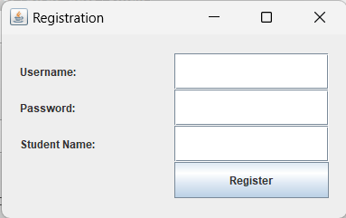

# Student Information Management System (SIMS) - Java Swing and JDBC Project


## Overview
The Student Information Management System (SIMS) is a Java-based desktop application built using the Swing framework for the user interface and JDBC for database connectivity. It provides a comprehensive solution for managing student records, including their personal information, grades, contact details, and more.

### Features
- User-friendly graphical interface.
- Secure login and registration system.
- View, add, update, and delete student records.
- Database-driven for data consistency and reliability.

## Table of Contents
- [Installation](#installation)
- [Usage](#usage)
- [Screenshots](#screenshots)
- [Contributing](#contributing)
- [License](#license)

## Installation
1. Clone this repository to your local machine.
    ```sh
    git clone https://github.com/yourusername/SIMS.git
    ```
2. Create a MySQL database and import the `student.sql` file provided in the `mysql` directory.

3. Open the project in your NetBeans 8.2 IDE and configure the database connection in `DatabaseConnection.java`.

4. Add the JAR file to your project's build path. Instructions may vary based on your IDE.

5. Run the project.

## Usage
- Start the SIMS application and log in with your credentials.
- Use the intuitive interface to manage student records.

## Screenshots
Here Are the Screenshot of Project.





## Contributing
Pull requests are welcome. For major changes, please open an issue first to discuss what you would like to change.

Please make sure to update tests as appropriate.

## License
This project is licensed under the [MIT License](LICENSE).

